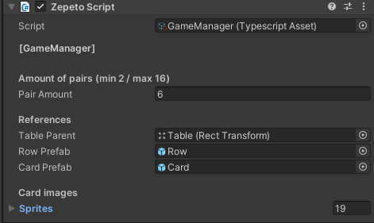
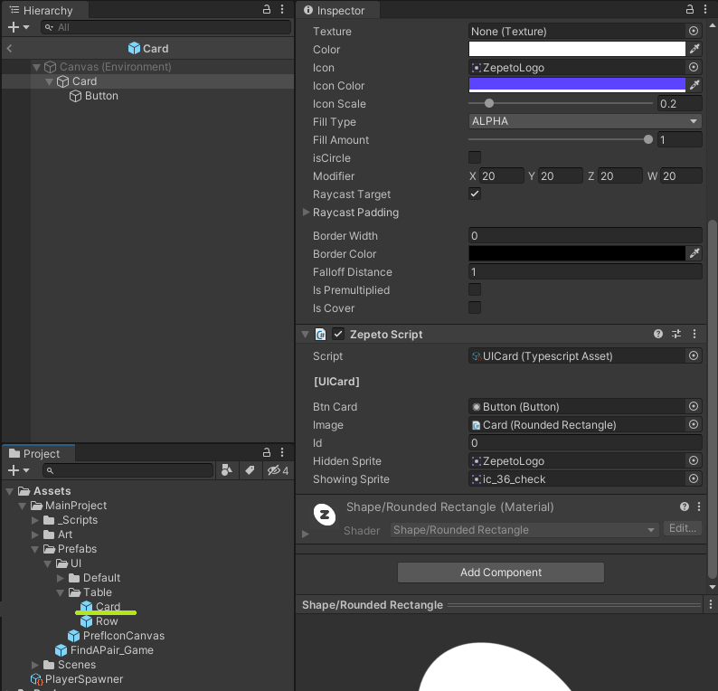
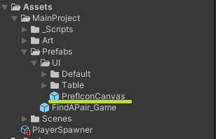

# Runner-Template

## 📢 About

Nice to meet you Creators! 👋 Welcome to Runner template guide!

With Runner you can create amazing worlds to play with your friends!

Now, are you ready to start?

  

## ❓ How to create with Runner template

:wrench: Installation and settings

- Download Unity Hub and Unity 2020.3.9f1 version. ([Download](https://unity.com/releases/editor/archive))

- Pull the repository.

  

> 💡 Enjoy and start creating with the Template! :tada:

  

## 🔨 Tools

**Game prefab**
To make things easier, there is a prefab called "FindAPair_Game" that you can drag into your game scene, and the mini-game will be already functional. You just need to place it wherever you want.

 </img> 

**UIManager**
In the UIManager you have the option to select how much it tooks to start the game. (the 3..2..1.. start!)

 </img> 

**GameManager**
The GameManager shows a lot of info.

| Variable       | Utility                                                                                                     |
| -------------- | ----------------------------------------------------------------------------------------------------------- |
| Pair amount    | The base amount of cards to create the matrix in the game                                                   |
| Table Parent   | This variable have the parent of the matrix, where it will be created                                       |
| Row Prefab     | A reference to the row prefab                                                                               |
| Card Prefab    | A reference to the card prefab                                                                              |
| Use thumbnails | This checkbox is to select if you want to use the thumbnails of your followers or the sprites that you want |
| Sprites        | The list of the sprites that can appear on the cards                                                        |

 </img> 

**Card Prefab**
The card prefab is how look the cards that will be created on the game.
They have the UICard script that have some important references.

| Variable       | Utility                                                                              |
| -------------- | ------------------------------------------------------------------------------------ |
| Btn Card       | Reference to the button to set the action by scripting                               |
| Image          | Reference to the card image to change between the hide and show sprite               |
| Id             | This value will be automatically set by the gamemanager when the creating the matrix |
| Hidden Sprite  | This sprite will be shown when the card is 'hidden'                                  |
| Showing Sprite | This sprite will be shown when the card is 'Showing'                                 |

 </img> 

**Row Prefab**
The row prefab is like a parent with the "Horizontal layout group" component to order the cards that will be created.

**NPCCreator**
The NPCCreator have his own documentation in de Zepeto Docs, there is a link to check it! https://docs.zepeto.me/studio-world/docs/creating-and-controlling-npc

**IconInteraction**
The IconInteraction like the NPCCreator have his own docs here: 
https://docs.zepeto.me/studio-world/docs/interacting-with-an-object#step-2--setting-the-object
If you want to change the icon that appears over the npc you have to change the PrefIconCanvas prefab
 </img> 
 </img> 

